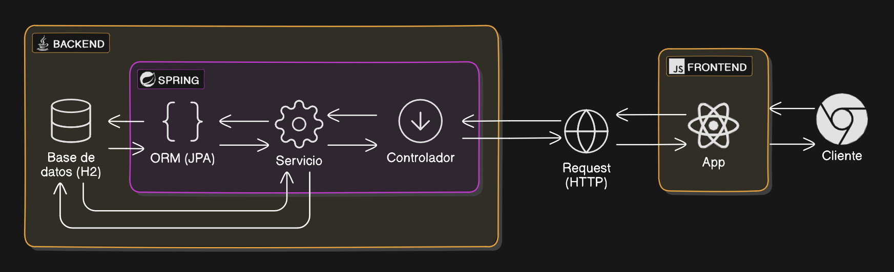

# Sistema de reservas de vehiculos

## Diagrama de Arquitectura:



## Documentación de los endpoints

Toda la documentación se genero usando Postman. Esta se encuentra en el siguiente [link](https://documenter.getpostman.com/view/21069316/2sAXqp8P1R)

## Ejecución

La versión de Java usada es la 17, por lo que se requiere el JDK 17 para ejecutar localmente. Maven se encarga de las dependencias, por lo que solo es necesario clonar el codigo y en el directorio del proyecto usar el comando
```
./mvnw spring-boot:run 
```
Alternativamente se puede usar (requiere Maven instalado en el PATH)
```
mvn spring-boot:run
```

### Acceso a la base de datos

Para la base de datos se uso la base de datos en memoria H2 (escenarios de desarrollo). Se accede a esta mediante http://localhost:8080/h2-console 

Los datos de acceso son:
- URL: jdbc:h2:mem:testdb
- Usuario: sa
- Contraseña: password